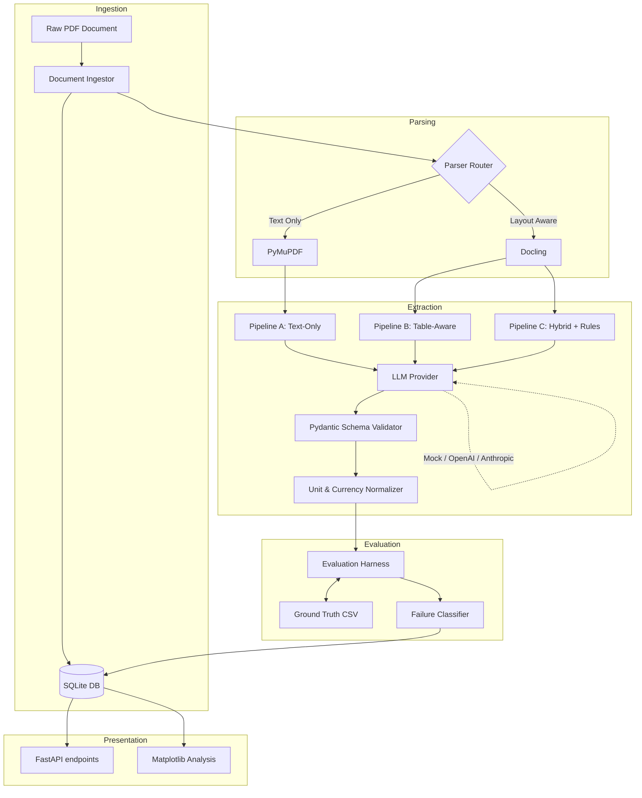

# FinExtract-Bench

A technically rigorous benchmark evaluating applied LLM pipelines for extracting structured financial data from messy PDF reports. 

This project explores the tradeoffs between extraction accuracy, token cost, processing latency, and failure modes when using different PDF parsing and LLM orchestration strategies.

## Overview

Extracting exact financial metrics (Revenue, Net Income, EPS, etc.) from annual reports is notoriously difficult due to complex table structures, floating text, unit scaling (e.g. "in millions"), and OCR errors. 

**FinExtract-Bench** compares three distinct pipelines:
1. **Text-Only Pipeline (`pymupdf`)**: Fast, cheap, context-unaware.
2. **Layout-Aware Pipeline (`docling`)**: Slower, highly structured, preserves table layouts.
3. **Hybrid Pipeline**: Layout-aware with multi-step semantic consistency checking.

The project features a full evaluation harness, automatic failure taxonomy classification (e.g. `UNIT_NORMALIZATION`, `SIGN_ERROR`), and cost tracking for OpenAI and Anthropic models.

---

## Architecture



## Features

- **Idempotent Ingestion**: Documents are hashed (SHA-256) ensuring no duplicate processing.
- **Provider Protocol Abstraction**: Easily swap between Mock, OpenAI, and Anthropic APIs.
- **Robust Normalization**: Automatically converts "(4.5B)" to `-4500000000.0`.
- **Automatic Failure Classification**: Heuristic engine categorizes errors into buckets like `COLUMN_SHIFT` or `UNIT_NORMALIZATION` without human intervention.
- **Cost Estimation**: Predicts pipeline cost based on `input_tokens` and `output_tokens` against a YAML pricing registry.
- **Reproducibility**: Every experiment stores a snapshot of the config, raw LLM JSON, parsed bounding boxes, and error traces in SQLite.

## Installation

```bash
# Clone the repository
git clone https://github.com/yourusername/finextract-bench.git
cd finextract-bench

# Create a virtual environment
python -m venv .venv
source .venv/bin/activate

# Install dependencies (Docling includes PyTorch, so this is heavy)
pip install -r requirements.txt
```

## Usage

### 1. Run the CLI Benchmark Experiment
Execute a full evaluation run using the dummy Mock provider (no API key required) over the sample dataset.
```bash
./scripts/run_experiment.py --name mock-run --provider mock --model mock-model
```

### 2. Run with Real LLMs
Configure your environment variables, then pass the provider flag.
```bash
export OPENAI_API_KEY="sk-..."
./scripts/run_experiment.py --name gpt4o-run --provider openai --model gpt-4o
```

### 3. Launch the API Server
Interact with the pipelines via a RESTful API.
```bash
uvicorn src.finextract.api.main:app --reload
```
Navigate to `http://localhost:8000/docs` to test the Swagger UI.

## Evaluation Taxonomy

When the benchmark detects an error against the Ground Truth CSV, it categorizes it as one of the following:

- `MISSING_VALUE`: The LLM failed to extract the target metric.
- `UNIT_NORMALIZATION`: The value is off by exactly 1,000x or 1,000,000x.
- `SIGN_ERROR`: The magnitude is correct, but the value was extracted as positive instead of negative (e.g. Net Loss).
- `VALIDATION_ERROR`: The LLM returned improperly formatted JSON.
- `NEEDS_REVIEW`: The error requires human auditing (e.g. grabbed Gross Profit instead of Net Income).

## Project Structure

```text
├── data/
│   ├── sample/                # Synthetic PDF data
│   └── ground_truth/          # Manual extraction CSVs
├── scripts/
│   └── run_experiment.py      # Main CLI runner
├── src/finextract/
│   ├── api/                   # FastAPI endpoints
│   ├── config/                # Environment and settings
│   ├── evaluation/            # Metrics, failure classification, cost
│   ├── experiments/           # Experiment runner orchestration
│   ├── extraction/            # Pipelines, Prompts, LLM Abstractions
│   ├── normalization/         # Regex-based number/currency parsers
│   ├── parsing/               # Docling & PyMuPDF logic
│   ├── provenance/            # End-to-end trace tracking
│   └── storage/               # SQLAlchemy ORM models
└── tests/                     # 60+ Pytest Unit & Integration tests
```

## License
MIT License
